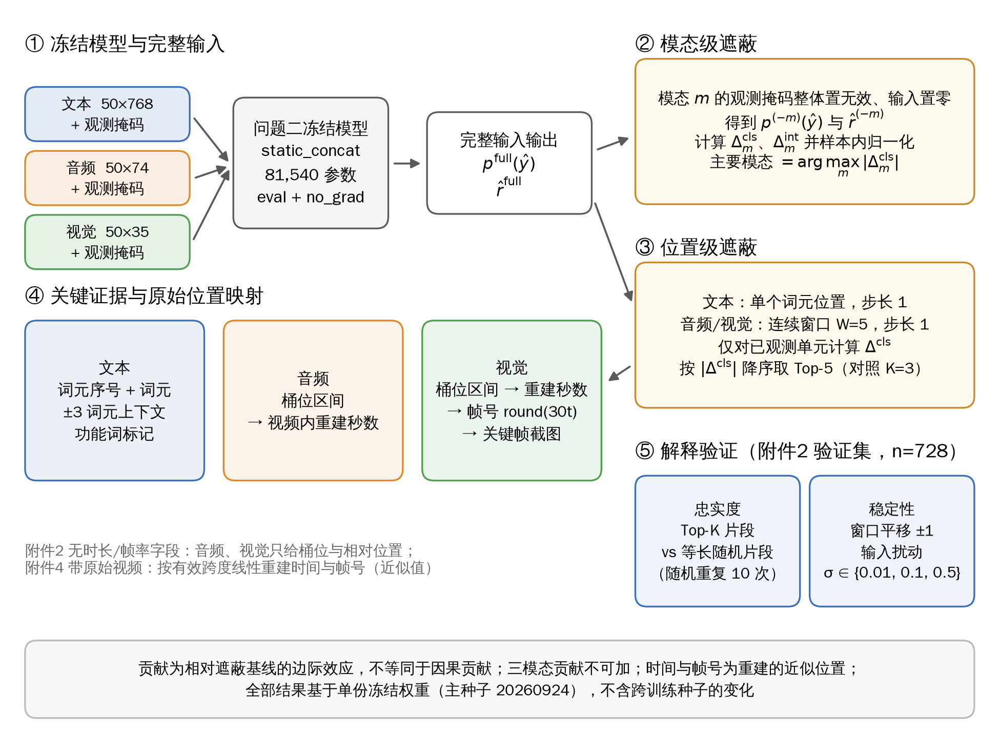
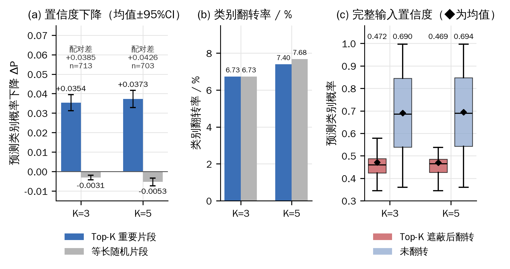
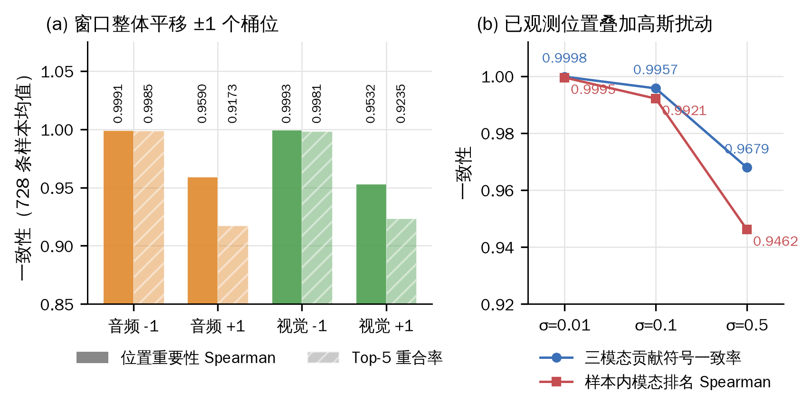
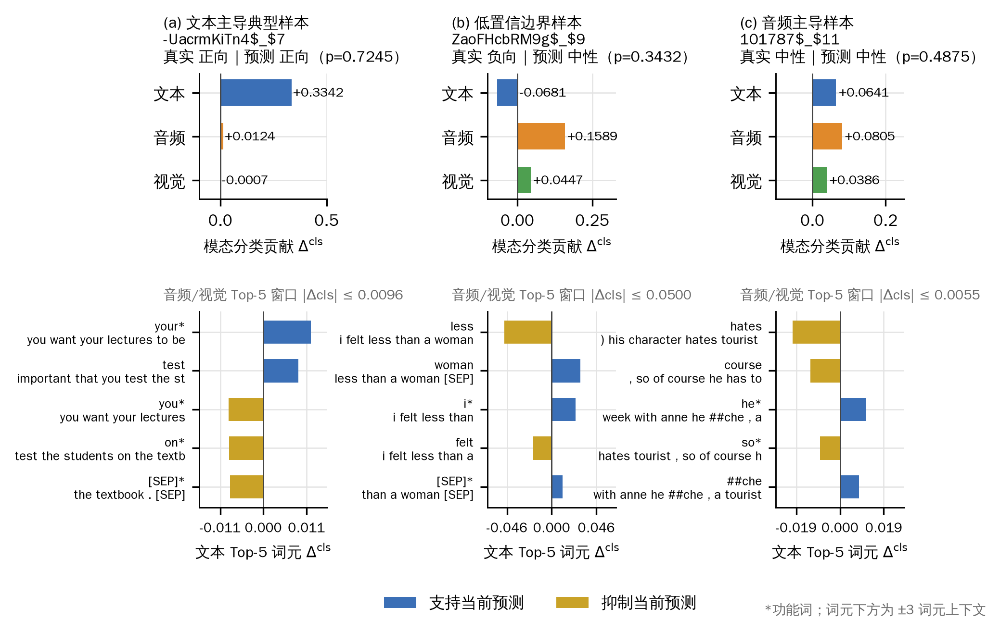
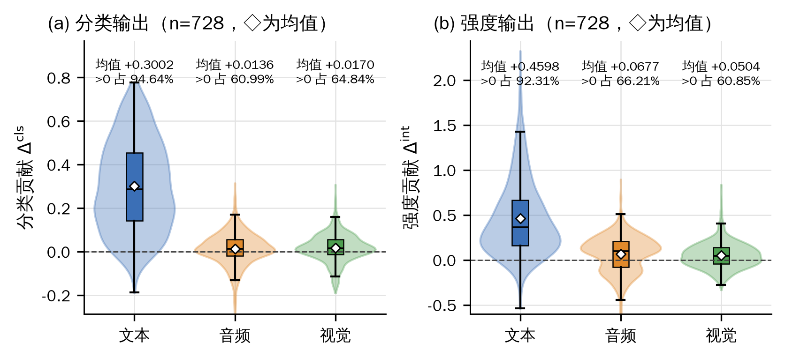
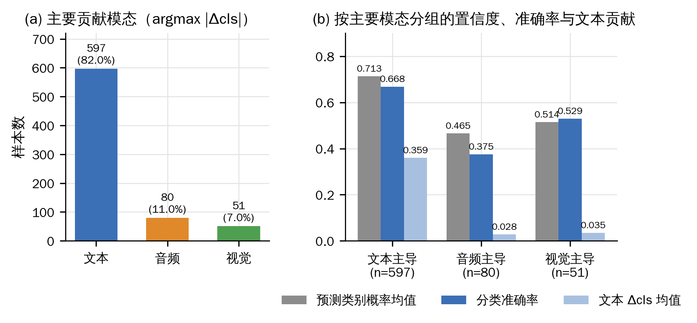
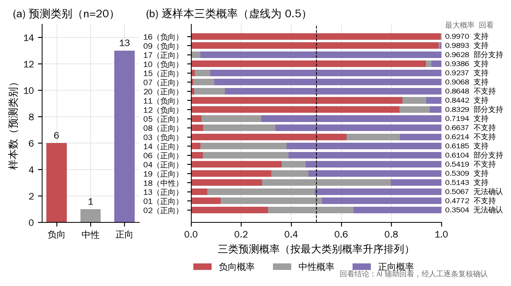
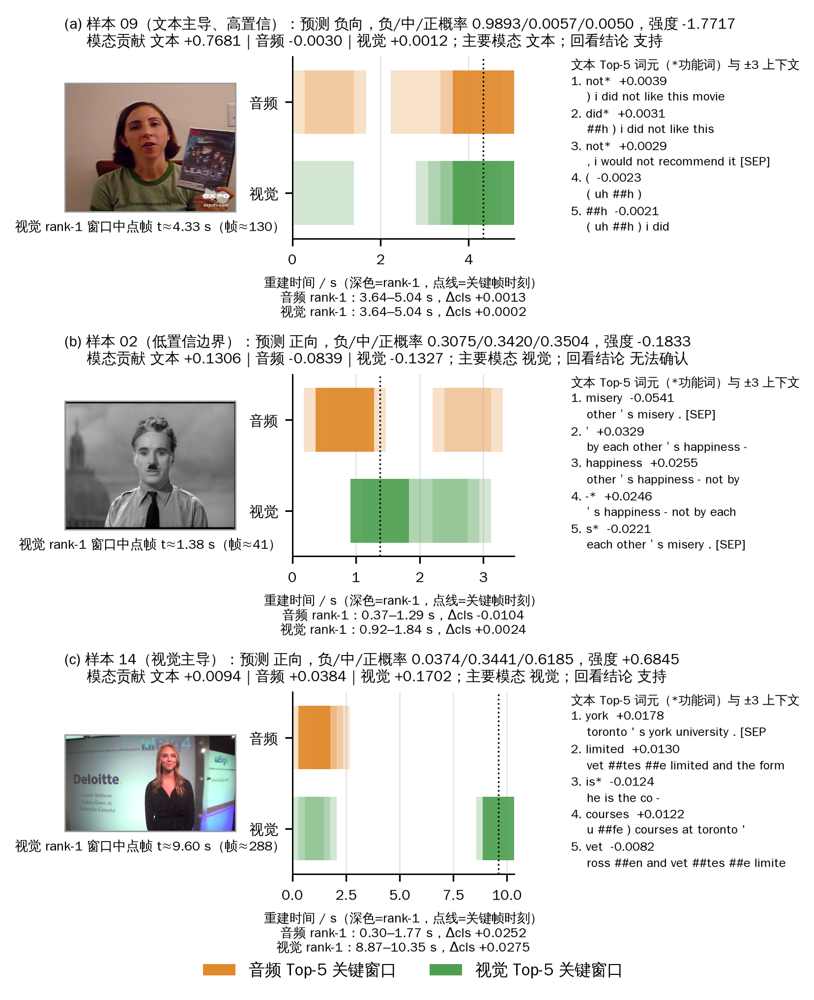

# 7 问题三：可解释多模态情感预测

## 7.1 模型建立

### 7.1.1 可解释性任务定义

问题三要求在输出情感预测的同时给出可检验的判断依据。本文将其形式化为三个层次的归因问题：在样本层面，解释模型为何对样本 $i$ 输出当前的极性类别与情感强度；在模态层面，量化文本、音频、视觉三种模态对该输出的边际贡献及其方向；在位置层面，将贡献定位到文本词元与音视频时间片段，并建立其与原始材料之间的可回溯映射。

解释对象为冻结模型的两个输出：完整输入下预测类别 $\hat y_i$ 的后验概率 $p_i^{\mathrm{full}}(\hat y_i)$，以及连续情感强度 $\hat r_i^{\mathrm{full}}$。二者分别对应分类与回归任务，量纲不同，因而分别定义贡献，不作加权合成。

问题三属于事后解释（post-hoc explanation），不对模型重新训练。为避免解释过程向专项数据泄漏信息，数据使用遵循以下约束：解释方法及窗口长度、Top-K等超参数仅在附件2验证集（728条，含标签）上确定与检验；附件4的20条专项视频样本仅用于一次性推理与解释，不参与训练、调参、阈值选择或标准化参数拟合。附件4不含标签字段，本章对其仅报告预测结果、置信度与解释证据，不计算Accuracy、Macro-F1或MAE等监督指标，预测类别亦不作为真实类别使用。

### 7.1.2 多模态预测模型结构

被解释模型为第六章确定的三模态静态拼接模型 `static_concat`（6.1.3节）。记样本 $i$ 第 $m$ 种模态的输入为 $X_i^{(m)}\in\mathbb{R}^{T\times d_m}$，观测掩码为 $M_i^{(m)}\in\{0,1\}^{T}$，其中 $T=50$，$d_t=768$、$d_a=74$、$d_v=35$。各模态经独立线性编码器映射至64维隐空间（ReLU激活，Dropout比例0.2），按观测掩码作掩码平均池化得到模态表示 $h_i^{(m)}$，三者拼接为192维向量后经128维融合层，分别接入三分类头与强度回归头。按上述结构逐层累计，参数量为 $49{,}216+4{,}800+2{,}304+24{,}704+387+129=81{,}540$，与模型登记值一致。

解释采用问题二主种子20260924的冻结权重，标准化参数沿用问题二在训练集上的拟合结果，推理全程处于 `eval()` 与 `no_grad()` 模式，权重不作任何更新。该权重在附件2验证集上的准确率为0.6264，与表6-1中静态拼接模型的验证集结果一致，表明解释所依托的推理路径与问题二完全相同。

该结构的两项性质直接制约解释结果的形态。其一，掩码平均池化对时间维作均匀聚合，单一位置在池化表示中的权重约为有效长度的倒数，位置级扰动的边际效应因而天然偏小。其二，模型不含样本级动态门控，跨模态交互仅发生于拼接后的融合层，因此对单一模态的整体遮蔽能够较为直接地反映该模态表示对输出的作用。

### 7.1.3 模态贡献度计算方法与解释对象

本文采用基于扰动的遮蔽法（occlusion）[1]计算贡献。该方法仅作用于输入副本与观测掩码，与模型“三模态张量＋观测掩码”的输入接口天然兼容，不需要改动网络结构，也不依赖梯度的可得性与平滑性；同时，模态级遮蔽与第六章整条模态缺失实验采用同一操作，两章结果可以在同一口径下对照。

**模态级基线。** 对模态 $m\in\{t,a,v\}$（依次表示文本、音频、视觉），将其观测掩码整体置为无效、对应输入置零，其余输入保持不变，记遮蔽后预测类别的概率为 $p_i^{(-m)}(\hat y_i)$，强度预测为 $\hat r_i^{(-m)}$。

**分类贡献。** 以完整输入下的预测类别为固定目标，定义

$$
\Delta^{\mathrm{cls}}_{i,m}=p_i^{\mathrm{full}}(\hat y_i)-p_i^{(-m)}(\hat y_i). \tag{7-1}
$$

$\Delta^{\mathrm{cls}}_{i,m}>0$ 表示移除模态 $m$ 后模型对 $\hat y_i$ 的置信度下降，即该模态支持当前预测；$\Delta^{\mathrm{cls}}_{i,m}<0$ 表示该模态对当前预测起抑制作用。目标类别始终固定为 $\hat y_i$，不随遮蔽后的最大后验类别变化，以保证三种模态的贡献针对同一被解释对象，具有可比性。

**强度贡献。** 为使“支持当前强度输出”在符号上统一为正，定义

$$
\Delta^{\mathrm{int}}_{i,m}=\operatorname{sign}\!\left(\hat r_i^{\mathrm{full}}\right)\left(\hat r_i^{\mathrm{full}}-\hat r_i^{(-m)}\right). \tag{7-2}
$$

当 $\hat r_i^{\mathrm{full}}>0$ 时，遮蔽导致强度减小记为支持；当 $\hat r_i^{\mathrm{full}}<0$ 时，遮蔽导致强度向零回退同样记为支持。

**归一化与主要模态。** 为比较同一样本内三种模态的相对作用，定义样本内归一化贡献

$$
\widetilde{\Delta}_{i,m}=\frac{\Delta_{i,m}}{\sum_{k\in\{t,a,v\}}\left|\Delta_{i,k}\right|}, \tag{7-3}
$$

分母小于 $10^{-9}$ 时整组置零。未归一化原值同时保留，以免三种模态贡献均接近零的样本在归一化后出现虚假的主导模态。主要贡献模态按分类贡献的绝对值确定：

$$
\hat m_i=\arg\max_{m\in\{t,a,v\}}\left|\Delta^{\mathrm{cls}}_{i,m}\right|. \tag{7-4}
$$

上述贡献的解释边界需要明确。首先，贡献度量的是相对于“置零且不可观测”基线的边际变化，而遮蔽样本偏离训练分布，存在分布外（out-of-distribution）效应[3]，因此贡献只反映模型对相应输入的依赖程度，不具有因果含义。其次，模态之间存在交互，单独遮蔽所得贡献之和一般不等于同时遮蔽全部模态的效应；Shapley值类方法[2]可以给出满足可加性的分解，但计算代价随组合数增长，本文未采用，也不对贡献作可加性解读。最后，各样本的基线置信度不同，未归一化贡献不宜跨样本直接比较。完整解释流程见图7-1。

**图7-1 多模态解释方法与遮蔽流程示意图。**

### 7.1.4 关键时间片段定位方法

模态级贡献只能确定起作用的模态，片段级定位还需要在模态内部实施位置级遮蔽。遮蔽单元依据模态特性设定：文本以单个词元位置为单元；音频与视觉为时间连续信号，单点遮蔽缺乏明确的物理含义，故采用长度 $W=5$、步长为1的连续窗口。50步网格上样本的有效跨度通常为20～48个位置，$W=5$ 约占有效跨度的10%～25%，兼顾了定位的局部性与效应的可检测性。未观测位置在遮蔽前后输入不变、贡献恒为0，故不纳入计算，以免稀释统计量。

对每个单元 $u$，按式(7-1)计算 $\Delta^{\mathrm{cls}}_{i,u}$，并按 $\left|\Delta^{\mathrm{cls}}_{i,u}\right|$ 降序选取前 $K=5$ 个单元作为关键证据，同时以 $K=3$ 作敏感性对照；$\Delta^{\mathrm{cls}}_{i,u}>0$ 记为支持证据，$\Delta^{\mathrm{cls}}_{i,u}<0$ 记为抑制证据。

单词元遮蔽在文本模态上存在固有局限。验证集文本Top-5证据中功能词占47.49%，rank-1证据中功能词占38.32%。其成因有二：一是在掩码平均池化下，移除一个词元仅改变约1/25的池化输入，信号幅度有限；二是BERT上下文化表示在相邻词元间高度相关，单一词元的边际贡献中噪声成分占比较高。因此，本文规定文本证据须同时给出±3个词元的上下文窗口与功能词标记，孤立的功能词不作为语义证据解读。

### 7.1.5 预测结果与原始证据映射

文本证据可由词元序号直接回溯到原始词元及其上下文；音频与视觉证据以50步网格上的桶位表示，需进一步映射到视频时间轴。

**附件2。** 附件2的对齐特征不含时长、采样率与帧率字段，音频与视觉已被重采样至与文本共享的50步网格，桶位与物理时间之间不存在固定换算关系。因此，附件2上的音视频证据仅给出桶位区间及相对位置 $\text{rel\_pos}=\text{桶位}/48$，秒数与帧号均标注为不可回溯，不作推测性补全。

**附件4。** 附件4提供20段原始视频（30 fps，时长3.11～21.35 s）。设某样本音频或视觉的有效跨度为桶位 $[v_0,v_1]$，$L=v_1-v_0+1$，视频时长为 $D$，则桶位 $j$ 对应的时间区间与帧号按下式重建：

$$
t_j\in\left[\frac{j-v_0}{L}D,\ \frac{j-v_0+1}{L}D\right),\qquad f=\operatorname{round}(30\,t). \tag{7-5}
$$

式(7-5)隐含的假设是有效跨度覆盖整段视频。与之竞争的假设是48个桶位均匀覆盖视频，此时有效跨度较短意味着内容仅位于视频前段。为区分两者，本文对8条样本解码音频能量包络，比较末端有声时刻与竞争假设给出的内容终点。8条样本的末端有声时刻均显著晚于后者，例如样本01在8.16 s处仍有语音，而竞争假设下内容应于4.13 s结束。竞争假设在全部8条样本上均被否定，故采用式(7-5)。

式(7-5)给出的是按有效跨度线性重建的近似位置，而非赛题提供的逐词或逐帧时间戳，其时间分辨率受桶位密度限制。以样本16为例，11个音频桶位覆盖3.11 s，单个桶位约对应0.28 s。重建时间足以支撑人工回看核对，但不足以证明三种模态在语义层面实现了精确同步。

## 7.2 模型求解与结果分析

### 7.2.1 解释计算策略与参数设置

问题三沿用问题二冻结的 `static_concat` 及其标准化参数，全部解释计算均为确定性前向推理。推理阶段Dropout处于关闭状态，推理随机数的改变不影响模型输出；随机种子仅用于随机对照片段的抽样与扰动噪声的生成。表7-1所列设置均在附件2验证集上确定后固定，附件4推理时原样沿用，未调整任何阈值。

**表7-1 解释计算策略与参数设置**

| 项目 | 取值 |
|---|---|
| 被解释模型 | 问题二冻结 `static_concat`，81,540 参数，主种子 20260924 |
| 推理方式 | `eval()` + `no_grad()`，确定性推理；不训练、不调参、不搜索阈值 |
| 标准化参数 | 复用问题二训练集拟合结果，不重新拟合 |
| 解释对象 | 预测类别概率 $p(\hat y)$ 与情感强度 $\hat r$，分别定义贡献 |
| 模态级基线 | 目标模态观测掩码整体置无效，输入置零 |
| 位置级遮蔽单元 | 文本：单词元，步长1；音频/视觉：连续窗口 $W=5$，步长1 |
| 关键证据数 | 按 $\Delta^{\mathrm{cls}}$ 绝对值降序取 Top-5；忠实度对照 K=3 |
| 随机对照 | 同长度随机片段，重复10次取均值 |
| 输入扰动 | 已观测位置叠加 $\mathcal N(0,\sigma^2)$，$\sigma\in\{0.01,0.1,0.5\}$，各重复3次 |
| 窗口平移 | 音频/视觉窗口划分整体平移 ±1 个桶位 |
| 解释随机种子 | 20260926（仅用于随机对照与扰动抽样） |
| 文本证据输出 | 词元序号、词元、±3 词元上下文、功能词标记 |
| 音频/视觉证据输出 | 附件2：桶位区间与相对位置；附件4：重建秒数、帧号与关键帧 |

### 7.2.2 验证集性能、基线对比与错误分析

被解释模型在附件2验证集上的准确率为0.6264。据第六章表6-1，多数类基线为0.4643，单文本、单音频与单视觉模型分别为0.6264、0.4666与0.4670；表6-2的消融结果显示，移除文本后准确率降至0.4620，移除音频或视觉后分别为0.6287与0.6236。上述结果表明，模型的判别能力几乎完全来源于文本模态。本节以此为参照，检验解释结果是否与模型的实际行为相一致。第六章图6-5的混淆矩阵进一步显示，中性类召回率最低，仅为34.2%，其中50.0%的中性样本被误判为正向。

按预测正误与主要贡献模态对验证集分组，统计结果见表7-2。

**表7-2 验证集分组错误分析**

| 样本分组 | 样本数 | 准确率 | 预测类别概率均值 | 文本 $\Delta^{\mathrm{cls}}$ 均值 | 音频 $\Delta^{\mathrm{cls}}$ 均值 | 视觉 $\Delta^{\mathrm{cls}}$ 均值 |
|---|---:|---:|---:|---:|---:|---:|
| 全部 | 728 | 0.6264 | 0.6720 | 0.3002 | 0.0136 | 0.0170 |
| 预测正确 | 456 | — | 0.7225 | 0.3508 | 0.0086 | 0.0173 |
| 预测错误 | 272 | — | 0.5873 | 0.2153 | 0.0219 | 0.0167 |
| 文本为主要模态 | 597 | 0.6683 | 0.7131 | 0.3594 | −0.0010 | 0.0076 |
| 音频为主要模态 | 80 | 0.3750 | 0.4654 | 0.0277 | 0.1033 | 0.0275 |
| 视觉为主要模态 | 51 | 0.5294 | 0.5143 | 0.0346 | 0.0437 | 0.1111 |

误判样本的预测类别概率均值（0.5873）与文本贡献均值（0.2153）均低于正确样本（0.7225与0.3508），Mann-Whitney U检验的 $p$ 值分别为 $4.16\times10^{-22}$ 与 $6.5\times10^{-18}$。误判集中于文本证据较弱、模型置信度较低的样本。以音频为主要模态的80条样本准确率仅为0.3750，低于多数类基线0.4643；该组文本贡献均值仅为0.0277，音频成为主要模态主要源于文本边际贡献的缺失，而非音频提供了可靠的判别信息。文本主导组的准确率（0.6683）与置信度（0.7131）在三组中均为最高。解释结果与第六章单模态基线及消融实验的结论相互印证。

### 7.2.3 解释有效性与稳定性验证

**（1）忠实度检验。** 忠实度（faithfulness）衡量解释所指认的证据是否确实驱动了模型输出。本文采用删除式检验[4]：若Top-K片段确为关键证据，遮蔽该片段对输出的影响应显著大于遮蔽等长随机片段。对每条样本，在其主要贡献模态内分别遮蔽Top-K片段与等长随机片段（随机片段重复抽取10次取均值），以预测类别概率的下降量 $\Delta P$ 度量影响，定义配对差

$$
D_i=\Delta P_i^{\text{Top-}K}-\overline{\Delta P}_i^{\text{rand}}. \tag{7-6}
$$

检验结果见表7-3与图7-2。$K=3$ 时有效样本713条，Top-K片段引起的平均概率下降为0.0354，随机片段为−0.0031，按式(7-6)计算的配对差均值为0.0385（95%置信区间[0.0336, 0.0435]，中位数0.0257），77.28%的样本配对差为正；$K=5$ 时有效样本703条，对应结果为0.0373、−0.0053与0.0426（95%置信区间[0.0370, 0.0483]，中位数0.0305），配对差为正的样本占76.39%。Wilcoxon符号秩检验[6]的 $p$ 值分别为 $5.85\times10^{-56}$ 与 $1.33\times10^{-48}$，配对秩二列相关系数分别为0.6813与0.6378，属于较大效应。强度输出呈现一致的规律：遮蔽Top-K片段使强度绝对值平均下降0.0655（$K=3$）与0.0642（$K=5$），随机遮蔽则分别为−0.0112与−0.0144。两种 $K$ 取值下结论一致，表明结果对 $K$ 不敏感。

**表7-3 解释忠实度与稳定性指标（附件2验证集）**

| 检验 | 指标 | K=3 / 数值 | K=5 |
|---|---|---:|---:|
| 忠实度 | Top-K 遮蔽 $\Delta P$ 均值 | 0.0354 | 0.0373 |
| 忠实度 | 随机遮蔽 $\Delta P$ 均值 | −0.0031 | −0.0053 |
| 忠实度 | 配对差 $D$ 均值（$D>0$ 的比例） | 0.0385（77.28%） | 0.0426（76.39%） |
| 忠实度 | 配对差：文本组 / 音频组 / 视觉组 | 0.0449 / 0.0111 / −0.0003 | 0.0486 / 0.0200 / −0.0032 |
| 忠实度 | 类别翻转率：Top-K / 随机 | 6.73% / 6.73% | 7.40% / 7.68% |
| 忠实度 | 完整输入概率：翻转 / 未翻转样本 | 0.4715 / 0.6900 | 0.4693 / 0.6941 |
| 稳定性 | 窗口平移 −1 / +1：音频位置重要性 Spearman | 0.9991 / 0.9590 | — |
| 稳定性 | 窗口平移 −1 / +1：视觉位置重要性 Spearman | 0.9993 / 0.9532 | — |
| 稳定性 | 窗口平移 −1 / +1：音频 / 视觉 Top-5 重合率 | 0.9985 / 0.9173；0.9981 / 0.9235 | — |
| 稳定性 | 扰动 σ=0.01 / 0.1 / 0.5：贡献符号一致率 | 0.9998 / 0.9957 / 0.9679 | — |
| 稳定性 | 扰动 σ=0.01 / 0.1 / 0.5：模态排名 Spearman | 0.9995 / 0.9921 / 0.9462 | — |

**图7-2 Top-K重要片段与随机片段的忠实度比较。**（a）预测类别概率下降，误差线为95%置信区间；（b）类别翻转率；（c）Top-K遮蔽后翻转与未翻转样本在完整输入下的预测类别概率。

在置信度层面，解释所选片段对预测置信度的削弱作用显著强于随机片段，而随机片段的平均效应接近零甚至略为负值，解释满足置信度意义上的忠实性。在决策层面，遮蔽重要片段并未带来更高的类别翻转率（图7-2(b)）。翻转样本在完整输入下的预测概率均值约为0.47，未翻转样本约为0.69（图7-2(c)）；完整输入概率与是否翻转的点二列相关系数为−0.3027（$K=3$）与−0.3251（$K=5$），$p$ 值均小于 $10^{-15}$。可见类别翻转主要由样本与决策边界的距离决定，而非由被遮蔽片段的重要性决定。

按解释模态分层后，文本组配对差为0.0449与0.0486，音频组为0.0111与0.0200，视觉组接近于零（−0.0003与−0.0032）。以文本为解释模态的样本约占83%（$K=3$ 为83.2%，$K=5$ 为83.8%），总体忠实度主要由文本贡献，音频与视觉局部证据的忠实性缺乏充分支持。据此，本文将忠实度结论限定为置信度层面、以文本模态为主，不将其外推至类别决策层面，亦不作因果解读。

**（2）稳定性检验。** 稳定性（robustness）刻画输入或解释配置发生微小变化时解释结果的一致程度[5]。本文考察同一冻结权重下的两类变化：窗口划分整体平移与输入加性高斯扰动。由于推理过程是确定的，改变推理随机数不产生任何差异，因而不能以重复推理的方式评估稳定性。度量指标包括位置重要性序列的Spearman秩相关、Top-5位置重合率、三模态贡献的符号一致率以及样本内模态排序的Spearman秩相关，结果见表7-3与图7-3。

**图7-3 窗口平移与输入扰动下的解释稳定性。**（a）音频、视觉窗口整体平移±1个桶位后的位置重要性Spearman相关与Top-5重合率（728条样本均值）；（b）已观测位置叠加不同强度高斯噪声后的三模态贡献符号一致率与样本内模态排名Spearman相关。

窗口整体平移一个桶位后，音频与视觉位置重要性的Spearman秩相关介于0.9532～0.9993，Top-5重合率介于0.9173～0.9985。+1平移的一致性低于−1平移，原因在于窗口起点移至网格末端后可评估窗口数减少，属于实现层面的边界效应。输入扰动下，一致性随 $\sigma$ 增大单调下降；$\sigma=0.5$ 相当于在标准化特征上叠加0.5倍标准差的噪声，此时贡献符号一致率仍为0.9679，模态排序秩相关为0.9462。需要指出，符号一致率按“模态×样本”合并统计，而文本贡献在94.64%的样本上为正，总体指标主要由文本决定；现有结果未分别给出音频、视觉的一致率及逐样本分布，图7-3(b)仅报告总体点估计。

总体而言，在同一冻结模型下，解释结果对窗口平移与输入扰动具有较好的稳健性。由于未开展多训练种子的重训与重算，该结论不能推广至不同训练种子之间。

**（3）稀疏性与分散性。** 按Top-5规则，三种模态均保留约四分之一的可评估单元：文本平均24.52个词元中保留4.98个，音频19.55个窗口中保留4.79个，视觉18.17个窗口中保留4.55个。以关键单元的位置跨度衡量，文本、音频、视觉分别有432、546、491条样本（59.3%、75.0%、67.4%）的关键证据呈分散分布。这与掩码平均池化的全局聚合特性相符：Top-5仅代表局部边际效应最大的位置，模型决策并不局限于这些位置。

### 7.2.4 典型样本解释卡

为展示解释结果的判读方式，按预设规则从验证集中自动抽取三类样本生成解释卡：文本主导且置信度不低于0.6的典型样本、完整输入预测概率最低的边界样本，以及音频或视觉主导的样本。抽样规则事先固定，避免选择性呈现。三张解释卡的要点汇总于图7-4，完整解释卡列入附件。

**图7-4 验证集典型解释案例。** 上行为三模态分类贡献，下行为文本Top-5词元的分类贡献及其±3词元上下文。

**文本主导样本**（`-UacrmKiTn4$_$7`，真实正向，预测正向，$p=0.7245$）。文本、音频、视觉的分类贡献分别为+0.3342、+0.0124与−0.0007，经式(7-3)归一化后文本占0.9624。然而文本Top-5证据中有4个为功能词（your、you、on、[SEP]），唯一的内容词为 test（+0.0090），须结合“you want your lectures to be”与“important that you test the students on”两段上下文方能还原语义。该例表明，即便模态级贡献明确，单词元证据仍易落于功能词，上下文窗口对判读不可或缺。

**低置信边界样本**（`ZaoFHcbRM9g$_$9`，真实负向，预测中性，$p=0.3432$）。三类概率为0.3388/0.3432/0.3180，近乎均等，且为误判样本。文本贡献为−0.0681，即文本抑制了中性判断，其中 less（−0.0489）与 felt（−0.0192）为主要抑制证据，原句“i felt less than a woman”本身带有明显的消极倾向。音频贡献为+0.1589，成为主要模态。当文本证据方向与预测相悖时，幅度较弱的音频信号即可能将边界样本推向错误类别，此类样本的类别结论不宜作为解释依据。

**音频主导样本**（`101787$_$11`，真实中性，预测中性，$p=0.4875$）。音频贡献+0.0805，略高于文本（+0.0641）与视觉（+0.0386），三者处于同一量级。音频与视觉Top-5窗口的 $\left|\Delta^{\mathrm{cls}}\right|$ 均不超过0.0055，且以抑制方向为主或幅度极小。此处“音频主导”仅表示音频的边际贡献相对最大，并不意味着音频独立提供了判别信息。

### 7.2.5 三模态贡献差异分析

验证集728条样本的三模态贡献统计见表7-4与图7-5，主要贡献模态分布见图7-6。

**表7-4 验证集三模态贡献统计**

| 模态 | $\Delta^{\mathrm{cls}}$ 均值 | 标准差 | q10 | 中位数 | q90 | $\Delta^{\mathrm{cls}}>0$ 比例 | $\Delta^{\mathrm{int}}$ 均值 | $\Delta^{\mathrm{int}}>0$ 比例 | 主要模态样本数 |
|---|---:|---:|---:|---:|---:|---:|---:|---:|---:|
| 文本 | 0.3002 | 0.2044 | 0.0395 | 0.2868 | 0.5952 | 94.64% | 0.4598 | 92.31% | 597 |
| 音频 | 0.0136 | 0.0741 | −0.0744 | 0.0122 | 0.1009 | 60.99% | 0.0677 | 66.21% | 80 |
| 视觉 | 0.0170 | 0.0641 | −0.0657 | 0.0150 | 0.0893 | 64.84% | 0.0504 | 60.85% | 51 |

注：标准差为总体标准差。

**图7-5 验证集文本、音频和视觉贡献分布。**（a）分类贡献；（b）强度贡献。虚线为零贡献。

**图7-6 验证集主要贡献模态数量分布。**（a）按式(7-4)确定的主要贡献模态样本数；（b）各组的预测类别概率均值、准确率和文本分类贡献均值。

就贡献量级而言，文本分类贡献均值为0.3002，约为音频（0.0136）的22倍、视觉（0.0170）的18倍；按式(7-2)计算的强度贡献中，文本为0.4598，音频与视觉分别为0.0677与0.0504。这一结果与第六章的单模态基线（单文本0.6264，单音频0.4666，单视觉0.4670）及消融实验（移除文本后降至0.4620）相互印证，两类独立证据均指向文本为模型的主要判别来源。

就贡献方向而言，文本贡献为正的样本占94.64%，其10%分位数仍为正值（0.0395）；音频与视觉的分布均跨越零点，10%分位数分别为−0.0744与−0.0657，约35%～39%的样本在移除音频或视觉后，模型对当前类别的置信度反而上升。位置级证据呈现相同特征：在10,419条关键证据中，文本证据的抑制比例为40.9%，音频与视觉分别为47.4%与47.1%，接近半数，说明后两种模态的局部证据方向缺乏一致性。

就主要模态分布而言，728条样本中文本主导597条（82.0%），音频主导80条（11.0%），视觉主导51条（7.0%）。结合图7-6(b)与表7-2，音频与视觉主导样本的平均置信度仅为0.4654与0.5143，文本贡献均值仅为0.0277与0.0346。因此，这131条样本（18.0%）应理解为文本边际贡献微弱、三模态贡献普遍偏低的样本，而非由音频或视觉作出有效判别的样本。第六章整条模态缺失实验亦支持这一判断：整条移除音频时验证集准确率为0.6273，移除视觉时为0.6204（表6-3），变化均不足1个百分点，与本节0.01～0.02量级的音视频贡献相符。

此外，局部片段的贡献幅度远小于模态级贡献：关键证据的 $\left|\Delta^{\mathrm{cls}}\right|$ 均值为0.0145，最大值为0.2613，而文本模态级贡献均值为0.3002。局部片段贡献的大小不能用于推断模态整体的重要性。

### 7.2.6 附件4全量预测与解释结果

**（1）预测类别与置信度。** 冻结模型对附件4的20条样本执行一次推理。输入核验表明，20个样本ID唯一且与20段视频一一对应，字段形状符合冻结接口，数据中不含标签字段。预测结果为负向6条、中性1条、正向13条（图7-7(a)）。三类概率逐行之和均为1（6位小数舍入导致的最大偏差为 $1\times10^{-6}$），预测类别均与最大后验类别一致。

**图7-7 附件4预测类别与置信度分布。**（a）预测类别计数；（b）逐样本三类概率，按最大类别概率升序排列，右侧为最大概率与回看结论。图中类别均为模型预测，不是真实类别。

最大类别概率均值为0.7207，中位数0.6915，总体标准差0.1959，取值范围0.3504～0.9970；其中6条高于0.90，2条低于0.50（样本01为0.4772，样本02为0.3504）。情感强度预测均值为−0.0266，中位数0.2463，总体标准差0.9595，取值范围−2.5819～1.2546。分类别比较，负向预测的平均最大概率（0.8706）显著高于正向预测（0.6675），负向样本的文本贡献均值（0.6268）亦远高于正向样本（0.2391）。20条样本的最大类别概率与文本贡献的Pearson相关系数为0.8450（$p=2.76\times10^{-6}$），高置信预测主要由较强的文本证据支撑。

**（2）模态贡献。** 附件4上文本、音频、视觉的分类贡献均值分别为0.3490、0.0114与0.0181，与验证集（0.3002、0.0136、0.0170）处于同一量级，模态依赖结构在专项样本上保持一致。主要贡献模态中文本16条，音频2条（04、19），视觉2条（02、14）。文本贡献为正的样本占95%（仅样本04为负），视觉占70%，音频仅占35%（13条为负）。逐样本结果见表7-5。

**表7-5 附件4预测与解释一览**

| 样本 | 预测 | 负/中/正概率 | 最大概率 | top1−top2 | 强度 | 文本 $\Delta^{\mathrm{cls}}$ | 音频 $\Delta^{\mathrm{cls}}$ | 视觉 $\Delta^{\mathrm{cls}}$ | 主要模态 | 回看结论 |
|---|---|---|---:|---:|---:|---:|---:|---:|---|---|
| 01 | 正向 | 0.1173/0.4054/0.4772 | 0.4772 | 0.0718 | 0.2621 | 0.1378 | −0.0010 | −0.0181 | 文本 | 不支持 |
| 02 | 正向 | 0.3075/0.3420/0.3504 | 0.3504 | 0.0084 | −0.1833 | 0.1306 | −0.0839 | −0.1327 | 视觉 | 无法确认 |
| 03 | 负向 | 0.6214/0.2125/0.1662 | 0.6214 | 0.4089 | −0.3829 | 0.3651 | −0.0871 | 0.0421 | 文本 | 不支持 |
| 04 | 正向 | 0.3620/0.0960/0.5419 | 0.5419 | 0.1799 | 0.3215 | −0.1666 | 0.3015 | 0.1372 | 音频 | 不支持 |
| 05 | 正向 | 0.0420/0.2386/0.7194 | 0.7194 | 0.4808 | 0.6135 | 0.2304 | −0.0094 | 0.1222 | 文本 | 支持 |
| 06 | 正向 | 0.0469/0.3427/0.6104 | 0.6104 | 0.2677 | 0.6845 | 0.2844 | −0.0311 | −0.1311 | 文本 | 部分支持 |
| 07 | 正向 | 0.0084/0.0849/0.9068 | 0.9068 | 0.8219 | 0.9758 | 0.5342 | 0.0046 | 0.0148 | 文本 | 支持 |
| 08 | 正向 | 0.0480/0.2883/0.6637 | 0.6637 | 0.3754 | 0.3675 | 0.4002 | −0.0524 | −0.1023 | 文本 | 不支持 |
| 09 | 负向 | 0.9893/0.0057/0.0050 | 0.9893 | 0.9835 | −1.7717 | 0.7681 | −0.0030 | 0.0012 | 文本 | 支持 |
| 10 | 负向 | 0.9386/0.0218/0.0397 | 0.9386 | 0.8989 | −0.9203 | 0.7462 | −0.0272 | 0.0195 | 文本 | 支持 |
| 11 | 负向 | 0.8442/0.0949/0.0609 | 0.8442 | 0.7493 | −0.9123 | 0.5816 | −0.0093 | −0.0032 | 文本 | 支持 |
| 12 | 负向 | 0.8329/0.1207/0.0464 | 0.8329 | 0.7121 | −0.9147 | 0.5397 | −0.0418 | 0.0484 | 文本 | 部分支持 |
| 13 | 正向 | 0.0646/0.4288/0.5067 | 0.5067 | 0.0779 | 0.2035 | 0.1865 | −0.0456 | 0.0000* | 文本 | 无法确认 |
| 14 | 正向 | 0.0374/0.3441/0.6185 | 0.6185 | 0.2744 | 0.6845 | 0.0094 | 0.0384 | 0.1702 | 视觉 | 支持 |
| 15 | 正向 | 0.0144/0.0619/0.9237 | 0.9237 | 0.8618 | 1.0277 | 0.3525 | 0.0480 | 0.0201 | 文本 | 支持 |
| 16 | 负向 | 0.9970/0.0023/0.0007 | 0.9970 | 0.9947 | −2.5819 | 0.7602 | −0.0009 | 0.0014 | 文本 | 支持 |
| 17 | 正向 | 0.0030/0.0342/0.9628 | 0.9628 | 0.9286 | 1.2546 | 0.5537 | −0.0017 | 0.0089 | 文本 | 部分支持 |
| 18 | 中性 | 0.2837/0.5143/0.2020 | 0.5143 | 0.2307 | −0.2453 | 0.1104 | 0.0550 | 0.0725 | 文本 | 支持 |
| 19 | 正向 | 0.3210/0.1481/0.5309 | 0.5309 | 0.2098 | 0.2304 | 0.0640 | 0.1490 | 0.0523 | 音频 | 支持 |
| 20 | 正向 | 0.0127/0.1225/0.8648 | 0.8648 | 0.7423 | 0.7550 | 0.3918 | 0.0268 | 0.0379 | 文本 | 不支持 |

注：*样本13的视觉特征整条为零，视觉贡献无法评估，不表示视觉不起作用。回看结论经AI辅助回看、人工逐条复核确认；“支持”指画面、语音或文本中存在与预测极性方向一致的内容线索，不等同于预测正确。

**（3）关键证据与人工回看。** 每条样本输出三种模态各自的Top-5关键证据，共296条（文本100条、音频100条、视觉96条；样本13无视觉证据，以1条占位记录代替）。文本证据中功能词占43.0%，与验证集的47.5%处于同一水平，表明单词元遮蔽的局限在专项样本上同样存在。按视觉Top-3关键窗口的中点时刻截取关键帧共57张，其中45张随附件提交。

每条样本均配有时间轴总览、视觉关键窗口放大图与音频能量/基频（F0）曲线，先由AI辅助逐条判定，再经人工逐条复核，20条复核结果均为认可AI判定。由于复核以AI判定为起点而非独立标注，本文将其界定为“AI辅助回看、人工复核确认”，不视为独立的人工标注。判定标准为：画面、语音或文本中存在与预测极性一致的内容线索，记为“支持”；线索方向相反或不含情绪线索，记为“不支持”；证据不足以作出判断，记为“无法确认”。按预测类别汇总的结果见表7-6。

**表7-6 附件4回看结论与预测类别交叉**

| 预测类别 | 支持 | 部分支持 | 不支持 | 无法确认 | 合计 | 样本 |
|---|---:|---:|---:|---:|---:|---|
| 负向 | 4 | 1 | 1 | 0 | 6 | 支持：09、10、11、16；部分：12；不支持：03 |
| 中性 | 1 | 0 | 0 | 0 | 1 | 支持：18 |
| 正向 | 5 | 2 | 4 | 2 | 13 | 支持：05、07、14、15、19；部分：06、17；不支持：01、04、08、20；无法确认：02、13 |

时间对齐方面，20条样本均未发现证据位置与视频内容明显错位。以有声比例衡量，13条样本关键音频窗口的有声比例不低于全片水平，其余7条（02、03、05、06、09、17、20）略低，其中样本05最低（0.479，全片为0.541），与其片头黑屏段有关。总体上，关键音频窗口主要落于语音活动区间而非静音段，映射结果在内容层面是可信的。

内容支撑方面，负向预测的支撑程度明显高于正向预测。6条负向预测中，09、10、11、16的转写分别包含 did not like、terrible、ashamed、terrible 等显式消极表达，判为支持；12涉及信用受损这一消极话题，但表述为客观陈述，判为部分支持；03为贷款产品说明，未见消极情绪线索，判为不支持。13条正向预测中有5条获得支持，其中05、14、19主要依据画面中明显的笑容，07、15依据文本中的积极表述；另有4条不支持，01、08、20分别为技术讲解、活动开场与节目收尾，内容呈中性，04的转写还包含 nervous、blow it 等偏消极表达。这一模式与第六章在附件3上观察到的正向预测比例偏高相一致，提示在文本证据较弱或语义含混时，模型存在向正向类别偏置的倾向。鉴于附件4仅20条且无标签，本文不将该结果换算为错误率，亦不据此调整模型或阈值。

**（4）特殊样本说明。** 样本02的三类概率为0.3075/0.3420/0.3504，最高与次高概率之差仅0.0084，类别判定接近随机水平；其强度预测为−0.1833，与正向类别方向相反，是20条中唯一分类输出与回归输出方向不一致的样本；此外，视频末尾约1 s为静音，尾段重建时间仅供参考。样本13的视觉特征整条为零，而原始视频画面正常（会议室场景，讲者面向听众），属于特征提取环节的缺失，其视觉贡献不可评估，不能解读为视觉模态不起作用；其余19条样本的音频与视觉非零桶位数逐条相等，仅13号例外。样本04的文本贡献为−0.1666，即移除文本后模型对正向类别的置信度反而上升，说明模型并非在所有样本上都以文本为依据。

**（5）代表案例。** 图7-8给出三个代表样本的关键证据回看图：文本主导的高置信样本09、低置信边界样本02与视觉主导样本14。20条样本的完整回看图与解释卡列入附件。

**图7-8 附件4典型样本关键证据回看图。** 左列为视觉rank-1关键窗口中点的关键帧；中列为音频、视觉Top-5关键窗口在视频内的重建时间位置（深色为rank-1，点线为关键帧时刻）；右列为文本Top-5词元及其±3词元上下文。时间与帧号均为按有效跨度重建的近似值。

样本09的文本贡献为+0.7681，音频与视觉仅为−0.0030与+0.0012，模型以0.9893的概率判为负向。文本前三位证据为 not、did、not，对应上下文“i did not like this movie”与“i would not recommend it”，否定结构与转写内容一致；但各词元的贡献均小于0.004，高置信判断源于文本整体而非个别词元。样本02的文本中同时存在 happiness（+0.0255）与 misery（−0.0541）两类方向相反的证据，视觉贡献为−0.1327，三类概率近乎均等，人工回看亦无法确定其情感倾向，与模型的低置信状态相符。样本14的视觉贡献为+0.1702，远高于文本（+0.0094）；视觉rank-1窗口位于重建时间8.87～10.35 s，对应关键帧中讲者面带微笑，而文本为人物履历介绍，情感上呈中性。该样本的正向判断主要来源于视觉信号，与回看观察一致。

## 7.3 本章小结

本章以问题二冻结的 `static_concat` 模型为对象，采用模态级与位置级遮蔽法对极性分类概率与情感强度两个输出进行事后解释，并将关键证据定位至文本词元、音频时间窗口与视频帧。主要结论如下。

（1）模型的判别能力主要来源于文本模态。验证集上文本分类贡献均值为0.3002，为音频（0.0136）与视觉（0.0170）的18～22倍；94.64%的样本文本贡献为正，82.0%的样本以文本为主要贡献模态，与第六章单模态基线及消融实验结论一致。音频与视觉贡献的分布跨越零点，以二者为主要模态的样本多为文本边际贡献微弱、整体置信度偏低的样本。

（2）解释结果在置信度层面具有忠实性。遮蔽Top-K片段引起的概率下降显著大于遮蔽等长随机片段（配对差0.0385与0.0426，$p<10^{-48}$），但二者的类别翻转率无差异，类别翻转主要取决于样本与决策边界的距离；分模态检验表明，忠实性主要体现于文本，视觉组接近于零。在同一冻结模型下，解释结果对窗口平移（Spearman秩相关不低于0.95）与 $\sigma=0.5$ 的输入扰动（符号一致率0.9679）具有较好的稳健性。

（3）对附件4的20条无标签样本，模型预测负向6条、中性1条、正向13条，最大类别概率均值为0.7207。关键证据经AI辅助回看与人工复核，均未发现明显的时间错位；负向预测大多获得内容支撑，而13条正向预测中有4条缺乏支撑，提示模型在文本证据不足时存在正向偏置倾向。

上述结论存在以下适用边界。贡献为相对遮蔽基线的边际效应，不具有因果含义，且三模态贡献不满足可加性；附件4的时间与帧号为按有效跨度重建的近似位置，而非原始时间戳；全部解释基于单一冻结权重，未开展多训练种子实验，无法判断解释结果在不同种子间的一致性；附件4缺少标签，本章结果仅能说明模型的决策依据及其证据位置，不能替代监督评价，也不能用于推断附件4的真实类别分布。

## 本章参考文献

（编号为本章临时编号，并入全文参考文献时请统一重编。）

[1] Zeiler M D, Fergus R. Visualizing and understanding convolutional networks[C]//European Conference on Computer Vision. Cham: Springer, 2014: 818-833.

[2] Lundberg S M, Lee S I. A unified approach to interpreting model predictions[C]//Advances in Neural Information Processing Systems 30. 2017: 4765-4774.

[3] Hooker S, Erhan D, Kindermans P J, et al. A benchmark for interpretability methods in deep neural networks[C]//Advances in Neural Information Processing Systems 32. 2019.

[4] DeYoung J, Jain S, Rajani N F, et al. ERASER: A benchmark to evaluate rationalized NLP models[C]//Proceedings of the 58th Annual Meeting of the Association for Computational Linguistics. 2020: 4443-4458.

[5] Alvarez-Melis D, Jaakkola T S. On the robustness of interpretability methods[EB/OL]. arXiv:1806.08049, 2018.

[6] Wilcoxon F. Individual comparisons by ranking methods[J]. Biometrics Bulletin, 1945, 1(6): 80-83.
